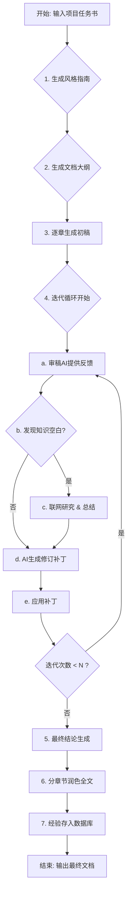

# 智能AI长文写作框架 (Autonomous AI Content Generation Framework)

[](https://www.python.org/)
[](https://opensource.org/licenses/MIT)

这是一个高度自主的、基于多智能体协作的 AI 内容生成与优化框架。它通过模拟一个由**战略规划师、作者、审稿人、研究员**和**编辑**组成的专家团队，围绕一个复杂的“项目任务书”（Prompt），自动地进行规划、研究、写作、迭代修订，并最终产出一篇结构完整、内容详实、逻辑严密的高质量长篇文档。

## 核心特性 (Core Features)

-   **📝 大纲驱动与规划优先 (Outline-Driven & Planning-First):**
    -   **风格指南生成**: 在项目开始时，AI 会首先根据任务书生成一份《风格与声音指南》，为整个项目定下基调。
    -   **工具化大纲**: 强制 AI 使用工具（Tool Calling）生成结构化的 JSON 大纲，从根本上保证了规划的可靠性与稳定性。

-   **🔄 双AI迭代优化 (Dual-AI Iterative Refinement):**
    -   **作者-审稿人循环**: 系统通过“作者 AI”生成内容，“审稿人 AI”提供深度批判性反馈的循环，对文稿进行多轮迭代优化。
    -   **结构化修订**: 修订过程不依赖于模糊的编辑指令，而是由 AI 生成精确的 JSON Patch（补丁）列表，程序通过模糊匹配标题来精确执行替换、插入、删除等操作。

-   **🧠 先进的上下文管理 (Advanced Context Management):**
    -   内置 `ContextManager` 类，为每一个写作任务动态构建“滑动窗口”式的精确上下文（包含前序章节内容、后续章节目标等），完美解决了超长文本生成中的上下文丢失问题。

-   **🌐 自动化研究与知识增强 (Automated Research & RAG):**
    -   **知识空白识别**: 审稿 AI 能自动识别出文稿中需要外部知识支撑的“知识空白”。
    -   **智能查询生成**: AI 研究员会将“知识空白”转化为多个具体的、高效的搜索引擎查询。
    -   **并发网络抓取**: 使用 `asyncio` 和 `aiohttp` 并发抓取搜索结果中的网页和 PDF，并将同步的 AI 总结任务放入独立线程，效率极高。
    -   **多 Key 轮换**: 支持配置多个 Google API Key 和 CSE ID，在遇到每日配额用尽的错误时，能够自动无缝切换，极大增强了研究能力。

-   **💾 经验积累与长期记忆 (Experience Accumulation & Long-Term Memory):**
    -   集成了 ChromaDB 向量数据库，可在每次成功运行后，将最终产出、成功的修订方案、研究简报等作为“经验”进行向量化存储，为未来的新任务提供可参考的历史知识。

-   **💪 高健壮性与可恢复性 (High Robustness & Resilience):**
    -   **检查点机制**: 在每次迭代后自动保存任务状态，即使程序意外中断，也可以从上次的断点处恢复，无需从头再来。
    -   **全面的重试逻辑**: 所有外部 API 调用（LLM, Google, Embedding）都集成了基于 `tenacity` 的指数退避重试机制，能有效应对临时的网络波动和服务不稳定。

## 工作流程 (Workflow)



## 项目结构 (Project Structure)

```
Deep Research/
│
├── 📄 .env                  # 存储 API 密钥和环境变量
├── 📄 .txt                  # 文本文件
├── 📄 README.md             # 项目说明文档
├── 📄 __pycache__\          # Python编译缓存
├── 📄 chroma_db\            # Chroma向量数据库
├── 📄 config\               # 配置模块
│   └── 📄 settings.py
│
├── 📁 core/                 # 核心业务逻辑模块
│   ├── 📄 context_manager.py
│   └── 📄 patch_manager.py
│
├── 📄 dev_toolkit.py        # 开发工具包
├── 📄 final_solution_20250806_210728.md  # 最终解决方案文档
├── 📄 main.py               # 程序的主入口
├── 📄 output\               # 输出目录
│
├── 📁 planning/             # 规划与大纲模块
│   ├── 📄 outline.py
│   └── 📄 tool_definitions.py
│
├── 📄 requirements.txt      # 项目依赖库列表
│
├── 📁 services/             # 外部服务交互模块
│   ├── 📄 llm_interaction.py
│   ├── 📄 vector_db.py
│   └── 📄 web_research.py
│
├── 📄 start_web_ui.py       # Web UI启动脚本
├── 📁 utils/                # 通用工具函数模块
│   ├── 📄 file_handler.py
│   ├── 📄 log_streamer.py
│   └── 📄 text_processor.py
│
├── 📄 uvicorn_log.txt       # Uvicorn日志
├── 📁 web/                  # Web相关文件
│   ├── 📄 ui_app.py
│   ├── 📄 static\           # 静态资源
│   └── 📄 templates\        # HTML模板
│
└── 📁 workflows/            # 主要工作流编排模块
    └── 📄 generation.py
```

## 安装与配置 (Installation & Setup)

#### 1. 克隆项目并进入目录
```bash
git clone <your-repository-url>
cd Deep Research
```

#### 2. 创建并激活虚拟环境
```bash
# Windows
python -m venv venv
.\venv\Scripts\activate

# macOS / Linux
python3 -m venv venv
source venv/bin/activate
```

#### 3. 安装依赖
```bash
pip install -r requirements.txt
```

#### 4. 配置 `.env` 文件
这是最关键的一步。请创建一个名为 `.env` 的文件，并填入以下内容。

```dotenv
# --- 核心 API 配置 ---
# DeepSeek AI API (必需)
DEEPSEEK_API_KEY="sk-xxxxxxxxxxxxxxxxxxxxxxxx"
DEEPSEEK_BASE_URL="https://api.deepseek.com/v1"

# 嵌入模型 API (推荐, 用于RAG和经验库)
EMBEDDING_API_KEY="your_embedding_api_key"
EMBEDDING_API_BASE_URL="https://your_embedding_api_endpoint/v1"

# Google 搜索 API (推荐, 用于研究功能)
# !! 重要: 密钥和CSE ID的数量和顺序必须一一对应 !!
GOOGLE_API_KEYS="key_A_xxxxxxxx,key_B_yyyyyyyy,key_C_zzzzzzzz"
GOOGLE_CSE_IDS="cse_id_A,cse_id_B,cse_id_C"

# --- 任务配置 ---
# !! 重要: 多行文本必须用一对双引号 " 从头到尾包裹起来 !!
USER_PROBLEM="# 核心任务 (Core Task)
创作一篇关于相对论的深度探究文章。本文必须严格遵循“第一性原理”，引导读者完成一次从经典物理学大厦的根基，到其出现的裂痕，再到狭义相对论这座新大厦如何建立的完整思想旅程。
... (此处省略中间部分，请将完整的“项目任务书”粘贴在此) ...
- 探究式叙事：行文应带有强烈的引导性和探究感，不断设问、分析、解决矛盾，带领读者主动思考，而不是被动接收信息。"

# 本地参考文件 (可选, 多个文件用逗号分隔, 推荐使用正斜杠 / )
EXTERNAL_FILES="C:/path/to/your/file1.pdf,C:/path/to/document2.txt"

# --- 运行参数 ---
MAX_ITERATIONS=4
INITIAL_SOLUTION_TARGET_CHARS=25000
```

## 如何运行 (How to Run)

1.  **配置任务**: 在 `.env` 文件中，仔细设置 `USER_PROBLEM` 来定义你的写作任务。
2.  **启动脚本**: 在激活虚拟环境的终端中，运行 `main.py`。
    ```bash
    python main.py
    ```
3.  **查看产出**: 
    * 所有的日志、中间产物（如大纲文件）和最终报告都会被保存在 `output/session_<timestamp>/` 目录下。
    * 最终的文稿通常命名为 `final_solution_....md`。

## Web UI 界面使用指南

### 启动方法
1. 确保已安装所有依赖:
   ```bash
   pip install -r requirements.txt
   ```
2. 运行启动脚本:
   ```bash
   python start_web_ui.py
   ```
3. 自动打开浏览器，访问 http://localhost:8000

### 功能介绍
- **首页**: 提交写作任务，设置主题、外部文件和目标长度
- **配置页**: 设置API密钥和系统参数
- **结果页**: 查看、下载和复制生成的内容

## 未来可改进方向 (Future Improvements)

-   **引入单元测试**: 使用 `pytest` 为核心工具函数编写测试用例，保证代码的长期稳定。
-   **API成本追踪**: 在 `call_ai` 函数中集成 token 消耗计算，在程序结束时估算总费用。
-   **交互式修订**: 在交互模式下，可以让用户审核并修改 AI 生成的修订补丁。
-   **Web 界面增强**: 添加更多功能，如历史任务查看、模板选择等。

## 许可证 (License)

本项目采用 [MIT License](https://opensource.org/licenses/MIT) 授权。